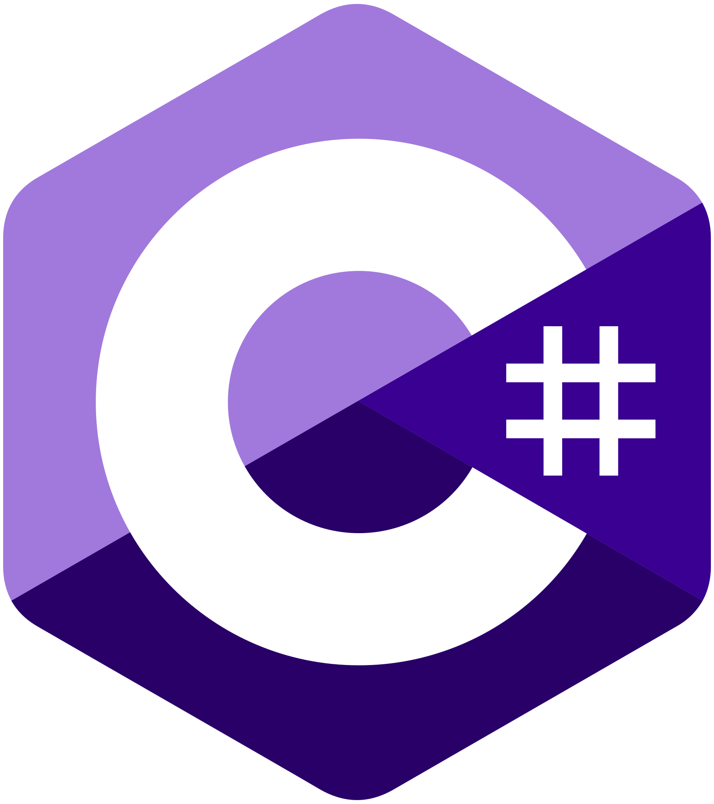
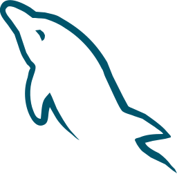
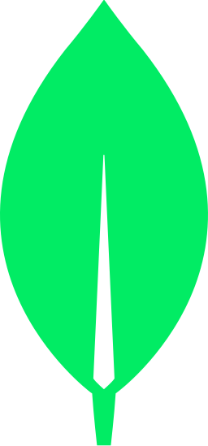
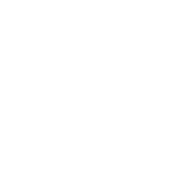
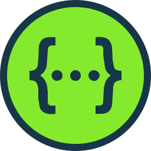

## Sobre Mim

*Técnico em Desenvolvimento de Sistemas (SENAI) • Estudante de Ciência da Computação (UNA) • Desenvolvedor Full Stack com forte foco em backend e engenharia de sistemas.*

## 🧰 Tech stack 🧰

### Linguagens, Bibliotecas e Frameworks

### Banco de Dados, CI e Testes

### Outras Tecnologias

### Artigos

    
  

## ✨ Principais feitos & conquistas ✨
- Formado como **Técnico em Desenvolvimento de Sistemas** (SENAI).  
- TCC / Protótipo: **Stockfy** — um sistema de gerenciamento de almoxarifado (protótipo e site).  
  - Repositório: [Stockfy - Repo](https://github.com/Maarzano/TCC) 
  - Site: [Stockfy - Live](https://stockfy-ten.vercel.app)  
- Desenvolvi todo o fluxo de gerenciamento de estoque, incluindo aprovações, controle de itens e operações de usuários (backend + frontend).  
- Experiência prática com autenticação (**Google OAuth2 + JWT**), backends em **Spring Boot** e stacks modernas em **JavaScript/Node.js**.

## 🎯 Foco & interesses 🎯
- Engenharia de backend, sistemas distribuídos, otimização de performance, fluxo de dados e arquiteturas de baixa latência.  
- Fascínio por como grandes empresas (Netflix, Pinterest, TikTok) projetam seus sistemas — estudo esses padrões e adapto melhores práticas para soluções enxutas e eficientes.  
- Objetivo: ser um **exército de um homem só**, desenvolvedor full stack capaz de entregar software de nível produtivo, escalável e com o mínimo consumo de CPU, memória e banda.

